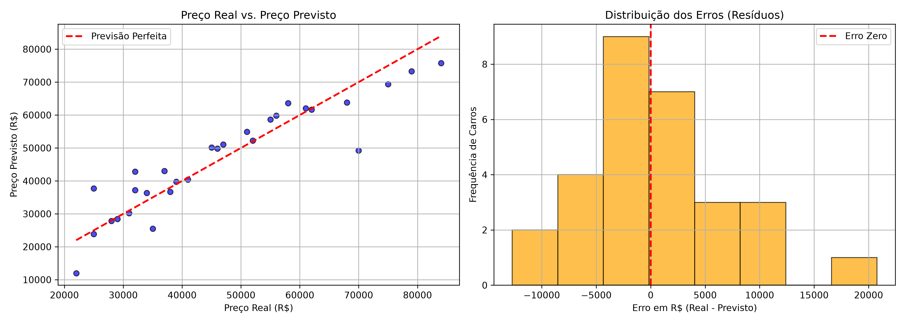

# Estimador de Preço de Carros Usados (Machine Learning)

Este é um projeto prático e evolutivo desenvolvido com o objetivo de aplicar os **fundamentos de Machine Learning e Engenharia de Dados** utilizando Python.

O sistema utiliza um modelo de regressão para estimar o preço de veículos com base em suas características físicas e histórico de uso, além de contar com **persistência de modelo em disco**, suíte de **testes automatizados**, interface interativa e retreinamento contínuo.

---

## Funcionalidades

- **Carga e Tratamento de Dados:** Leitura e estruturação automatizada de datasets em formato CSV usando `pandas`.
- **Treinamento e Avaliação:** Treinamento de modelo com divisão entre conjunto de Treino (75%) e Teste (25%).
- **Persistência de Modelo (Joblib):** Modelo treinado e serializado em arquivo binário (`.joblib`) para previsões instantâneas em ambiente de produção.
- **Testes Automatizados (Pytest):** Cobertura de testes garantindo a integridade da carga de dados e respostas válidas do modelo.
- **Interface Interativa (CLI):** Estimativa de preços em tempo real no terminal com base em entradas do usuário.
- **Feedback Loop & Retreinamento:** Inserção de novas vendas reais com atualização do dataset e recalibragem automática do modelo salvo.
- **Análise Gráfica:** Diagnóstico visual da qualidade das previsões e distribuição dos resíduos/erros via `matplotlib`.

---

## Análise Gráfica do Modelo

Abaixo está o diagnóstico visual gerado pelo script `visualization.py`, mostrando a proximidade das previsões com a linha perfeita e a distribuição dos erros de preço:



---

## Conceitos Aprendidos na Prática

1. **Supervised Learning (Regressão):** Uso do algoritmo `LinearRegression` para prever um valor numérico contínuo ($y = \text{Preço}$) a partir de atributos ($X = \text{Ano, Km, Potência}$).
2. **Serialização e Persistência de Dados:** Salvar o estado do modelo ajustado no disco com `joblib` para evitar a necessidade de retreinar o algoritmo a cada requisição.
3. **Qualidade & Testes de Código:** Utilização do `pytest` e `conftest.py` para garantir validação contínua da estrutura de dados e assertividade das estimativas.
4. **Qualidade de Dados vs. Desempenho:** Aumento substancial da métrica de determinação ($R^2$) de valores negativos para **~0.96** ao expandir a amostra de dados inicial e eliminar ruídos.
5. **Métricas de Avaliação de Regressão:**
   - **MAE (Erro Médio Absoluto):** Medida do erro direto em Reais (R$).
   - **RMSE (Raiz do Erro Quadrático Médio):** Penalização de grandes desvios.
   - **$R^2$ Score:** Capacidade explicativa do modelo sobre a variação dos dados.
6. **Resíduos & Viés:** Identificação de padrões de erro através de histogramas e scatter plots.

---

## Estrutura do Repositório

```text
ml-cars/
├── assets/
│   └── grafico_residuos.png    # Gráfico exportado de análise de desempenho
├── data/
│   └── cars.csv              # Dataset tabular com histórico de veículos
├── models/
│   └── modelo_carros.joblib    # Modelo binário treinado e serializado
├── src/
│   ├── load_data.py          # Leitura e inspeção do dataset com Pandas
│   ├── train.py              # Treinamento e persistência do modelo com Joblib
│   ├── evaluate.py           # Divisão treino/teste e cálculo das métricas
│   ├── predict.py            # Interface CLI usando modelo salvo (.joblib)
│   ├── add_data.py           # Coleta de novos dados e retreinamento automático
│   └── visualization.py      # Geração de gráficos de análise de erro (Matplotlib)
├── tests/
│   └── test_model.py         # Testes automatizados de dados e inferência (pytest)
├── .gitignore                # Arquivos e pastas ignorados pelo Git
├── conftest.py               # Configuração global de caminhos do Pytest
├── requirements.txt          # Dependências e bibliotecas do projeto
├── LICENSE                   # Licença de uso do código (MIT)
└── README.md                 # Documentação principal